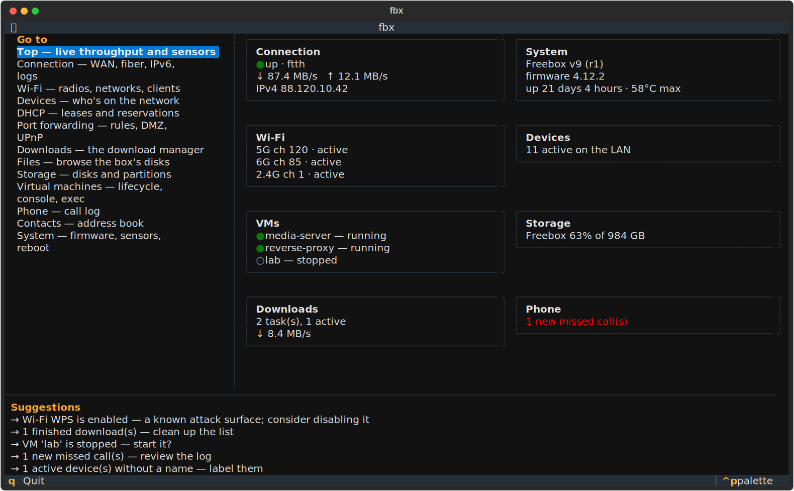

# freebox-cli

Pilotez intégralement votre **Freebox Ultra** (Freebox OS) depuis le
terminal : une **application interactive** qui s'ouvre d'un simple `fbx`,
une CLI scriptable complète, et un serveur MCP pour que les agents IA
pilotent la box — connexion, réseau local, DHCP, redirections de ports,
Wi-Fi, téléchargements, fichiers, téléphonie, et le gestionnaire de
**machines virtuelles** (API non documentée).

**Non officiel.** Ce projet n'est pas affilié à Free ni au groupe Iliad.
*(English summary [below](#english).)*

## Installation

Avec [Homebrew](https://brew.sh), ou depuis
[PyPI](https://pypi.org/project/freebox-cli/) avec
[`uv`](https://astral.sh/uv) / `pipx`, sur une machine du même réseau que
votre Freebox :

```sh
brew install kevingallaccio/tap/freebox-cli
# ou
uv tool install freebox-cli    # ou : pipx install freebox-cli
```

Le paquet s'appelle `freebox-cli` ; la commande, elle, s'appelle **`fbx`** —
trois lettres, comme la box. Sans rien installer :
`uvx --from freebox-cli fbx system info`.

## L'application

Tapez `fbx` et vous y êtes : un tableau de bord de toute la box — débit WAN
en direct, radios Wi-Fi, appareils, VMs, stockage, téléchargements,
téléphone — plus des **suggestions** qui pointent ce qui mérite un coup
d'œil (WPS resté activé, téléchargements terminés à nettoyer, une VM
arrêtée, des appareils sans nom…). Naviguez dans chaque domaine, agissez,
quittez avec `q`. Toute action destructrice demande confirmation.



Dans l'application : une vue `top` en direct (courbes de débit à la
seconde, températures, signal Wi-Fi par client), un **shell de fichiers**
dans le terminal (`/Freebox > ls`, `cd`, `mkdir`, `mv`, `cp`, `rm`,
`share`), et un écran VM complet qui attache la **console série** sur place
(Ctrl-] pour détacher, vous revenez dans l'application).

L'application est l'une des trois façades du même cœur — la CLI ci-dessous
et le serveur MCP restent scriptables à l'octet près ; `fbx` sans argument
n'ouvre l'application que sur un vrai terminal (dans un pipe, il affiche
l'aide comme avant).

## Premiers pas

Autorisez cette machine auprès de votre box — une étape unique qui demande
un appui physique :

```sh
fbx auth login
```

`fbx` s'enregistre auprès de la box, puis vous demande d'**appuyer sur ▶
(la flèche droite) sur l'afficheur de la Freebox**. Le jeton est enregistré
dans `~/.config/fbx/credentials.json` (mode 0600) ; les sessions se
renouvellent ensuite automatiquement.

```sh
fbx auth status          # sommes-nous autorisés, et sur quelle box ?
fbx auth permissions     # que peut faire cette application ?
fbx system info          # firmware, modèle, uptime, températures, ventilateurs
```

## Lire la box

Chaque domaine a sa commande, avec tableaux Rich (et `--json` pour les
scripts) :

```sh
fbx connection status    # état WAN, adresses, débit en direct
fbx connection ftth      # lien optique + puissance SFP (santé de la fibre)
fbx connection ipv6      # préfixes délégués
fbx connection logs      # historique up/down du WAN
fbx lan devices          # qui est sur le réseau (--all pour l'historique)
fbx lan interfaces       # interfaces navigables (pub, wifiguest, …)
fbx dhcp leases          # baux actifs
fbx dhcp static          # réservations statiques
fbx fw redirs            # règles de redirection de ports
fbx fw dmz               # hôte DMZ
fbx fw incoming          # ports entrants des services intégrés
fbx fw upnp              # état UPnP IGD (+ upnp-redirs pour les mappings)
fbx wifi status          # radios (2,4/5/5/6 GHz sur l'Ultra)
fbx wifi ap              # canal/largeur/état par radio
fbx wifi bss             # SSID + sécurité (clés via --json uniquement)
fbx wifi stations        # clients associés, signal, débits
fbx wifi mac-filter      # liste de contrôle d'accès MAC
fbx wifi neighbors 10    # scan des canaux : ce qu'entend l'AP 10 (--scan)
fbx wifi key             # affiche la clé Wi-Fi (à piper dans pbcopy)
fbx downloads list       # tâches de téléchargement
fbx downloads stats      # compteurs du gestionnaire
fbx storage disks        # disques physiques
fbx storage partitions   # occupation de l'espace
fbx fs ls /Freebox       # parcourir les fichiers de la box
fbx calls list           # journal d'appels de la ligne fixe
fbx contacts list        # carnet d'adresses
```

## Piloter la box

Chaque domaine a aussi ses commandes d'écriture. Les écritures affichent
une confirmation lisible sur stderr et l'objet de réponse de la box sur
stdout (compatible `--json`) ; les actions réellement irréversibles
demandent confirmation, contournable avec `--yes` :

```sh
# Réservations DHCP + Wake-on-LAN
fbx dhcp static-add 02:00:00:00:00:99 192.168.1.222 -c "imprimante"
fbx dhcp static-rm  02:00:00:00:00:99
fbx wol 02:00:00:00:00:0a

# Redirections de ports / DMZ / UPnP
fbx fw redir-add 192.168.1.42 8080 --wan-port 8080 --comment web
fbx fw redir-rm 3
fbx fw dmz-set 192.168.1.50        # …ou dmz-off
fbx fw upnp-set --disabled

# Wi-Fi (couper le Wi-Fi globalement demande d'abord — vous êtes peut-être dessus)
fbx wifi bss-set 02:00:00:00:00:10 --ssid "Maison" --key "s3cret…"
fbx wifi mac-filter-add 02:00:00:00:00:99 --type blacklist
fbx wifi ap-set 10 --no-he --no-eht    # Wi-Fi 6/7 off (matériel IoT ancien)
fbx wifi config-set --disabled         # demande sauf --yes

# Téléchargements
fbx downloads add "magnet:?xt=urn:btih:…"
fbx downloads pause 3 && fbx downloads resume 3
fbx downloads erase 3                  # supprime les fichiers → demande

# Fichiers (mv/cp/rm sont des tâches suivies jusqu'au bout)
fbx fs mkdir /Freebox/Téléchargements nouveau
fbx fs cp /Freebox/a --to /Freebox/b
fbx fs rm /Freebox/vieux --yes
fbx fs share /Freebox/film.mkv --days 7

# LAN / connexion / système / carnet d'adresses
fbx lan rename ether-02:00:00:00:00:0a "TV du salon"
fbx connection config-set --no-ping
fbx system reboot                      # demande sauf --yes
fbx contacts add "Sandy Kilo" --first Sandy --last Kilo
```

## Machines virtuelles

La Freebox Ultra embarque un hyperviseur aarch64. `fbx vm` gère tout le
cycle de vie — dont une **console série par WebSocket**, comme `virsh
console` s'attache au tty d'un invité :

```sh
fbx vm list                            # chaque VM + état, vCPU, RAM
fbx vm info                            # capacité de l'hyperviseur
fbx vm distros                         # catalogue d'images cloud de Free

# créer un disque, puis une VM, puis la démarrer
fbx vm disk-create /Freebox/VMs/web.qcow2 8G
fbx vm create --name web --disk /Freebox/VMs/web.qcow2 \
    --memory 512 --vcpus 1 --cloudinit-file cloud-init.yaml
fbx vm start 2
fbx vm console 2                       # console série (Ctrl-] pour détacher)

fbx vm shutdown 2                      # extinction ACPI propre
fbx vm stop 2                          # arrêt forcé (demande)
fbx vm rm 2                            # supprime la définition (demande)

# commande unique sur la console série (nécessite un shell sur le tty invité)
fbx vm exec 2 "uptime"

fbx vm userdata 2                      # userdata cloud-init brut
```

La console série utilise la dépendance `websockets` incluse ; les chemins
`--disk`/`--cd` sont absolus (`/Freebox/…`), et `cloudinit_userdata` (qui
contient clés SSH et mots de passe) n'apparaît que via `--json`, jamais
dans un tableau.

## Serveur MCP — laissez un agent piloter la box

`fbx mcp serve` expose toute la surface (109 outils répartis en 13
ensembles : system, connection, lan, dhcp, fw, wifi, downloads, files,
calls, contacts, storage, vm, raw) en serveur
[MCP](https://modelcontextprotocol.io) sur stdio. Même cœur que la CLI,
donc comportement identique ; les opérations destructrices portent les
annotations MCP pour que l'agent demande avant de redémarrer votre réseau.

Deux protections par défaut côté agent (désactivables par appel) : les
champs secrets — userdata cloud-init, clés Wi-Fi — sont **masqués** sauf
`include_secrets: true` (les humains ont `fbx vm userdata` / `fbx wifi
key`), et `fbx_lan_devices` ne renvoie que les appareils joignables sauf
`all: true` (l'historique complet pèse des centaines de Ko sur un LAN
vécu).

**Claude Code — le plugin (recommandé).** Une seule installation apporte le
serveur MCP *et* la skill fbx (garde-fous d'usage pour l'agent). Dans
Claude Code :

```
/plugin marketplace add KevinGallaccio/freebox-cli
/plugin install fbx@fbx
```

Le plugin lance le serveur via `uvx` **depuis sa propre copie du code** :
mettre à jour le plugin met à jour le serveur, rien d'autre à rafraîchir :

```
/plugin marketplace update fbx
```

Il faut [`uv`](https://astral.sh/uv) dans le PATH, et une box déjà
appairée (`fbx auth login`, un appui physique).

**N'importe quel client MCP (Claude Desktop, Cursor, Zed, …).** Installez
avec l'extra `mcp` et pointez votre client sur `fbx mcp serve` :

```sh
uv tool install 'freebox-cli[mcp]'
fbx mcp install        # affiche le câblage exact des clients courants
```

```json
{ "mcpServers": { "fbx": { "command": "fbx", "args": ["mcp", "serve"] } } }
```

**Dosez la surface à votre goût.** Tout est exposé par défaut — c'est
l'opérateur qui décide, pas l'outil :

```sh
fbx mcp serve --read-only              # aucune écriture
fbx mcp serve --toolsets vm,wifi       # seulement ces domaines
fbx mcp serve --exclude raw            # sans la trappe API brute
fbx mcp tools                          # prévisualise ce qu'expose un filtre
```

## Le contrat `--json`

Chaque commande qui produit des données accepte `--json` et affiche l'objet
résultat **entier** — rien de tronqué. Les données vont sur stdout ; tous
les messages, spinners et erreurs vont sur stderr, les pipes restent
propres :

```sh
fbx --json system info | jq '.firmware_version'
fbx api GET connection/ | jq '{state, media, rate_down}'
```

### `fbx api` — la trappe de secours

Un appel brut authentifié vers n'importe quel endpoint. Pratique partout où
une commande typée n'existe pas encore, et pour explorer l'API. Les chemins
se collent tels quels depuis la doc (un préfixe `/api/latest/` ou
`/api/v16/` est retiré) :

```sh
fbx api GET system/
fbx api GET vm/
fbx api POST vm/1/start
fbx api PUT wifi/config/ --data '{"enabled": true}'
```

## Feuille de route

- [x] Phase 0 — reconnaissance de l'API sur une vraie Freebox Ultra (privée)
- [x] Phase 1 — découverte, auth, `fbx system info`, `fbx api` (**v0.1.0**)
- [x] Phase 2 — tous les domaines en lecture, `--json` partout (**v0.2.0**)
- [x] Phase 3 — opérations d'écriture sur chaque domaine (**v0.3.0**)
- [x] Phase 4 — cycle de vie VM + console série (**v0.4.0**)
- [x] Phase 5 — serveur MCP + plugin & skill Claude Code (**v0.5.0**)
- [x] Phase 6 — PyPI + tap Homebrew + l'application interactive (**v0.6.0**)
- [x] Phase 7 — dépôt prêt pour les contributions (règles, modèles, protection)
- [ ] Phase 8 — retours d'usage réel et améliorations UI/UX de l'application

## Contribuer

Les contributions sont bienvenues — tout se développe et se teste **sans
Freebox** (la suite mocke la box). Lisez [CONTRIBUTING.md](CONTRIBUTING.md) ;
les failles de sécurité passent par [SECURITY.md](SECURITY.md), jamais par
une issue publique.

## Développement

Rien à installer pour bidouiller le dépôt — le shim `./fbx` amorce `uv` et
lance la CLI depuis les sources :

```sh
git clone https://github.com/KevinGallaccio/freebox-cli
cd freebox-cli
./fbx --version

uv sync                 # dépendances + outils de dev
uv run pytest           # la suite tourne entièrement hors ligne (box mockée)
uv run ruff check src tests scripts
```

Pas besoin de Freebox pour contribuer : les tests mockent la box.

---

## English

`freebox-cli` gives you full control of the **Freebox Ultra** (the fiber
router/NAS/hypervisor of French ISP Free) from the terminal: an
**interactive app** (just type `fbx`: dashboard, live tiles, contextual
suggestions, confirm-gated actions), a complete scriptable CLI —
connection, LAN, DHCP, port forwarding, Wi-Fi, downloads, files, telephony,
and the undocumented **virtual machine manager** with a WebSocket serial
console — plus an **MCP server** (109 tools) and a Claude Code plugin so AI
agents can drive the box.

```sh
brew install kevingallaccio/tap/freebox-cli   # or: uv tool install freebox-cli
fbx auth login       # one-time pairing — press ▶ on the Freebox front panel
fbx                  # the interactive app
fbx system info      # scriptable CLI, --json everywhere
fbx --json api GET connection/ | jq
```

For agents: `fbx mcp serve`, or in Claude Code
`/plugin marketplace add KevinGallaccio/freebox-cli` then
`/plugin install fbx@fbx`. Data on stdout, everything else on stderr;
destructive operations prompt (bypass with `--yes`).

The full documentation above is in French — the Freebox only exists in
France. **Unofficial:** this project is not affiliated with Free or the
Iliad group.
